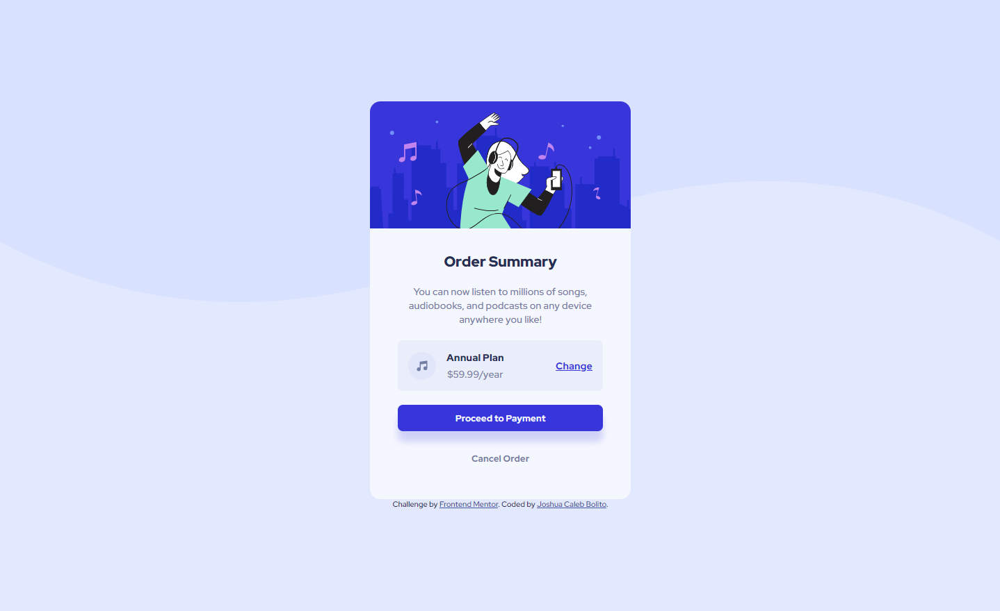
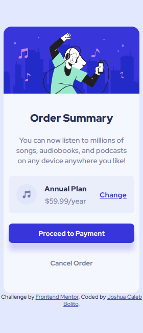

# Frontend Mentor - Order summary card solution

This is a solution to the [Order summary card challenge on Frontend Mentor](https://www.frontendmentor.io/challenges/order-summary-component-QlPmajDUj). Frontend Mentor challenges help you improve your coding skills by building realistic projects. 

## Table of contents

- [Overview](#overview)
  - [The challenge](#the-challenge)
  - [Screenshot](#screenshot)
  - [Links](#links)
- [My process](#my-process)
  - [Built with](#built-with)
  - [What I learned](#what-i-learned)
  - [Continued development](#continued-development)
- [Author](#author)


## Overview
This mini-project involves the creation of a responsive product preview card component using plain HTML and CSS.

### The challenge
Users should be able to:

- See hover states for interactive elements

### Screenshot






### Links

- Solution URL: [GitHub Repository](https://github.com/JCBolito/order-summary-component-main)
- Live Site URL: [GitHub Pages](https://jcbolito.github.io/order-summary-component-main/)

## My process
Breaking down the project into smaller chunks, the following process were taken to guarantee the project's completion:

1. Structure the HTML.
1. Using Flexboxes, use CSS to design the webpage.
1. Adjust the CSS to make the webpage responsive and usable for various mobile device sizes, the smallest of which it can accomodate is the Samsung Galaxy Fold.

### Built with

- Semantic HTML5 markup
- CSS custom properties
- Flexbox

### What I learned

Upon completing this project, I was able to practice my skills in media queries and using flexboxes.

I used the following media query to change the background of the body when the device screen size reaches:

```css
@media screen and (max-width: 375px) {
	body {
		background-image: url(images/pattern-background-mobile.svg);
	}
}
```

The following media query on the other hand is used to adjust the padding of the card in smaller mobile device screen sizes such as Samsung Galaxy Fold:

```css
@media screen and (max-width: 340px) {
	main .details {
		padding: 20px 10px;
	}
}
```

### Continued development

Although I am satisfied with my final output on this project, I feel like I still need to polish my responsive CSS techniques, specifically in using Media Queries. I will try to improve my code for this project once I learn more about Media Queries on my learning journey using [The Odin Project](https://www.theodinproject.com/).


## Author

- Website - [Joshua Caleb Bolito](https://github.com/JCBolito)
- Frontend Mentor - [@JCBolito](https://www.frontendmentor.io/profile/JCBolito)